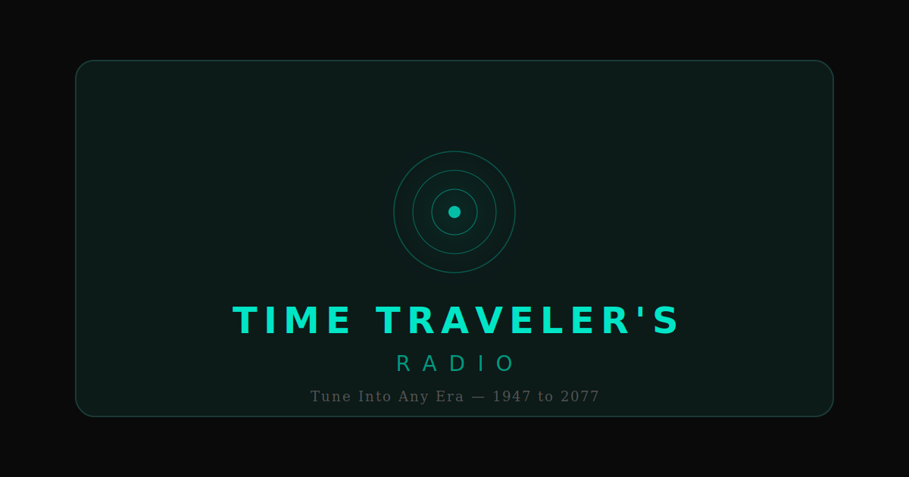

# Time Traveler's Radio

A retro car radio that lets you travel through time. Pick a city, dial a year from 1947 to 2077, and hear the music and news of that era.

**[Live Demo](https://time-traveler-radio.onrender.com)**



## Features

- **20 global cities** across 13 music regions — from New York to Tokyo, Cairo to Sydney
- **130+ years of music** (1947–2077) with real YouTube tracks for each era and region
- **Era-accurate audio processing** — pre-1960s sound lo-fi with hiss, modern tracks in full fidelity
- **AI news bulletins** — era-specific news read by synthesized voices matching each decade's style
- **6 hidden easter eggs** — discover special events at certain years (hint: try 1985, 1969, 2077...)
- **Interactive world map** — zoom, pan, click cities to tune in
- **Procedural audio** — engine start, frequency scanning, radio static, all synthesized in real-time
- **Retro VFD display** — scanlines, glitch effects, and glowing phosphor text
- **Fully responsive** — works on mobile and desktop
- **Accessible** — keyboard navigation, ARIA labels, screen reader support

## Tech Stack

| Layer | Technology |
|-------|-----------|
| UI | React 19, Tailwind CSS 4, Framer Motion |
| Audio | Web Audio API, YouTube IFrame API, Web Speech API |
| Build | Vite 7 |
| Server | Express 4 |
| Deploy | Docker, Render.com |

## Getting Started

```bash
# Install dependencies
npm install

# Start dev server
npm run dev

# Production build
npm run build

# Run production server
npm start
```

## Docker

```bash
# Build image
docker build -t time-traveler-radio .

# Run container
docker run -p 3000:3000 time-traveler-radio
```

## Deploy to Render

1. Push to GitHub
2. Connect repo on [Render](https://render.com)
3. Render auto-detects `render.yaml` and deploys

Or use the Blueprint button:

[](https://render.com/deploy)

## Project Structure

```
src/
  App.jsx                     # Root layout
  hooks/
    useRadioAudio.js          # Master state machine
    useYouTubePlayer.js       # YouTube player wrapper
    useRadioStatic.js         # Ambient hum + static
  engine/
    RadioManager.js           # Web Audio API controller
    SecretFrequencyHandler.js # Easter egg system
  components/
    PowerButton.jsx           # On/off with ignition sequence
    VFDDisplay.jsx            # Retro LED display
    YearDial.jsx              # Rotary year selector
    WorldMap.jsx              # Interactive SVG map
    SpeakerGrille.jsx         # Audio visualizer
    VolumeSlider.jsx          # Volume knob
    NewsButton.jsx            # News bulletin trigger
  data/
    musicDatabase.js          # 13 regions, 130+ tracks
    newsDatabase.js           # Historical news headlines
    cities.js                 # 20 global cities
```

## How It Works

1. **Power on** triggers a 4-phase ignition: engine rumble, frequency scanning, coordinate sync, welcome message
2. **Year dial** applies real-time audio filters — older years sound like vintage AM radio
3. **City selection** maps to one of 13 music regions and loads era-appropriate tracks
4. **Music plays** via hidden YouTube iframe, while the equalizer visualizes audio data
5. **News bulletins** use Web Speech API with decade-appropriate voice personas
6. **Easter eggs** activate at specific years with custom audio/visual experiences

## Security

- Content Security Policy (CSP) restricting scripts, frames, and resources
- HSTS enforcing HTTPS
- X-Frame-Options DENY
- Permissions-Policy blocking camera/mic/geo
- Non-root Docker user
- Zero npm vulnerabilities

## License

MIT
